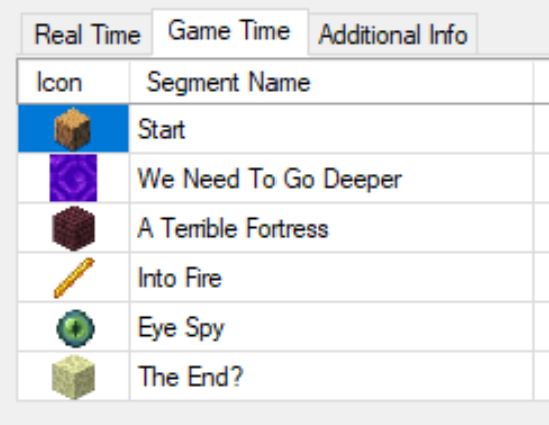

 

  

  <h2 align="center">MinecraftAutosplit</h2>

  

    <i>A tool designed to automatically create splits in a speedrunning timer when advancements are made.</i>
     
    <a href="../../issues">Report Issue</a>
    -
    <a href="../../issues">Request Feature</a>
  

# Overview

This tool will watch the advancement files in your most recently played world and press the `home` key when it detects an advancement made on route to completing the game. This assumes that another tool like [LiveSplit](https://livesplit.org/) is configured with these advancements in mind. See the following screenshot for an example:

  

The tool will automatically detect when you create new worlds or delete the world currently being watched.

# TODO

Add configuration for splits hotkey and minecraft saves directory

# Note

This application is only known to run on Windows. There are no plans to port to other operating systems, but feel free to make a fork and/or pull request.
